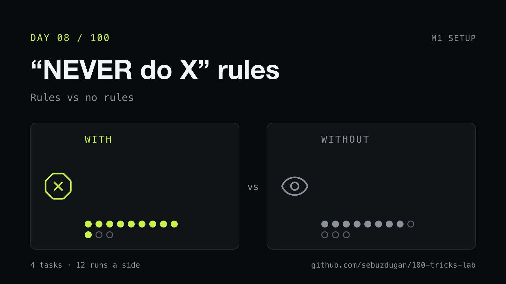
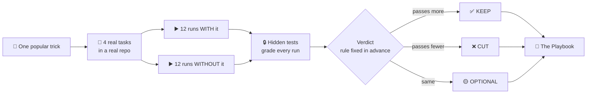
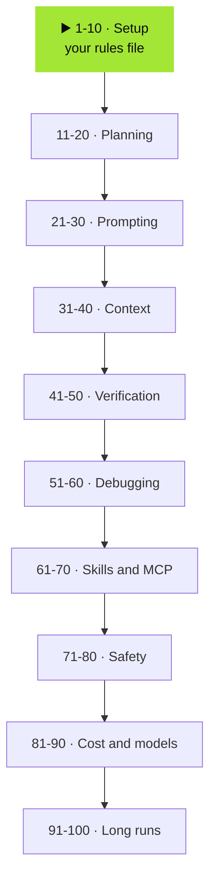

<h1 align="center">100 AI coding tricks, tested</h1>

<p align="center">
One popular AI coding tip a day, for 100 days.<br>
Run on real code with the trick and without it, graded by tests the agent never sees.<br>
<b>Every run, diff and log in this repo.</b>
</p>

<p align="center">
  
</p>

## Why

Most AI coding advice is somebody's good day. This is a measurement: same repo, same tasks, same model, one thing changed.

Nothing is cherry-picked. Days where the trick did nothing get posted too.

## How one day works



The verdict rule is written down **before** the runs, in [PROTOCOL.md](PROTOCOL.md). Every change to it is dated in that file's log.

## The Playbook so far

| Day | The trick | Result | Verdict |
|---|---|---|---|
| 1 | The viral 65-line rules file | 7/12 vs 7/12 | 🟡 optional |
| 2 | Let `/init` write the rules file | 10/12 vs 10/12 | 🟡 optional |
| 3 | Short rules file (49 lines) vs long (582) | 8/12 vs 8/12, short ran faster | ✅ keep |
| 4 | The SuperClaude framework | 7/12 vs 9/12 | ❌ cut |
| 5 | One rules file per package | 8/12 vs 8/12 | 🟡 optional |
| 6 | An ARCHITECTURE.md map, read first | 9/12 vs 7/12 | ✅ keep |
| 7 | Build and test commands in the rules file | 10/12 vs 7/12 | ✅ keep |
| 8 | Four "NEVER do X" rules | 10/12 vs 8/12, but 5 rule breaks either way | 🟡 optional |

A new row lands here the day its post goes live.

## The road



## What's in here

| Folder | What you'll find |
|---|---|
| `runs/dNN/` | every run of that day: the verdict, each diff, each step the agent took |
| `tricks/dNN/` | the exact files that made up the trick |
| `tasks/` | the four tasks, and the hidden tests that grade them |
| `plan/` | all 100 days: the trick, the source, what to watch for |
| `PROTOCOL.md` | the rules, including the verdict rule and every change to it |

**The setup:** an AI coding agent (Claude Code on Haiku 4.5) working headless in a copy of a real open-source repo, four tasks, three runs per task per side. A budget model on purpose: stronger models passed almost everything, so no trick could show a difference.

<details>
<summary><b>Run it yourself</b></summary>

```bash
harness/setup_base.sh                         # rebuild the baseline repo
export LAB_CLAUDE_CONFIG_DIR=~/.claude-lab    # a clean agent config, so your own setup stays out of the runs
python3 harness/run.py d01 --dry-run          # prepare the copies, confirm the graders fail on the baseline
python3 harness/run.py d01                    # the day's runs, then the verdict
harness/publish_day.sh d01                    # commit and push that day's raw runs
```

A day is defined by `tricks/dNN/trick.json`: the tasks, the model, and what each side gets (files copied into the repo copy, a prompt prefix, a different model, extra tools, an extra checker). Copy `tricks/d01/trick.json` to start one.

</details>

## Follow along

The daily results go out as a 60-second video and a post with the numbers: [YouTube](https://sebuzdugan.com/l/yt) · [X](https://sebuzdugan.com/l/x) · [Medium](https://medium.com/@sebuzdugan)

Day cards use [Lucide](https://lucide.dev) icons (ISC).
